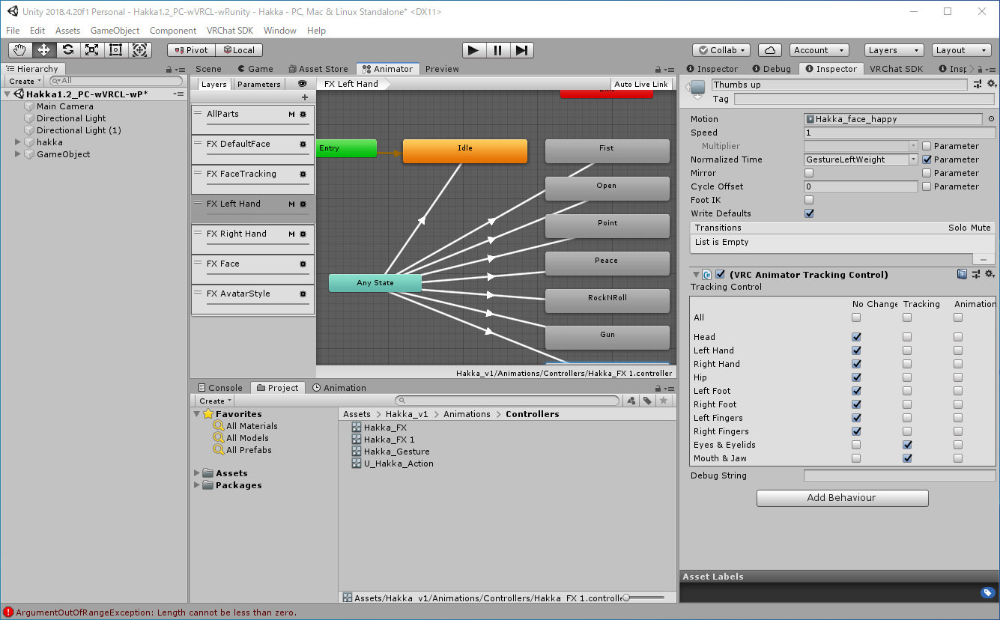
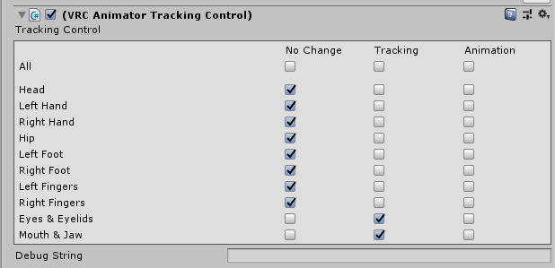

:imagesdir: ./

== 要旨

表情変更制御のAnimation Controller上で、表情クリップに `VRC Animation Tracking Control` を設定し、
`Eyes & Eyelids` と、`Mouth & Jaw` に Tracking を指定することで、
表情を変更したときにもまばたきとリップシンクを有効化することができる。

== はじめに

薄荷ちゃんはかわいいのですが、標準の設定では表情を変えたときにまばたきをしなくなり、リップシンクも無効になってしまいます。
この記事では、表情を変更したときにもまばたきをし、リップシンクできるようにする設定を紹介します。

=== 環境

* Unity 2018.4.20f1
* VRChat SDK Version Date 2021.01.19.18.17
* Hakka v1.2.2 VRCSDK3

== まばたきとリップシンク

まばたきやリップシンクの設定は `VRC Avatar Descripter` と呼ばれるスクリプトで設定しています。
VRChat向けアバターでは必須のスクリプトであり、薄荷ちゃんのプレハブではルートオブジェクトにくっついているスクリプトです。
同時に、`Pipline Manager` と呼ばれるスクリプトによって、アバターのID（BluePrintID）を記録しており、アバターの識別を行なっています。

== アニメーションコントローラーを見直す

=== 薄荷ちゃんのアニメーションコントローラー

表情の変更は、VRSDK3.0 （Avatars 3.0）の環境では、Animation Controllerによって表情の遷移を記述することで実現していますfootnote:[Animation Controllerそのものの解説はここではしません。ねこますさんの記事が完結にまとまっていて参考になるかと思います。「 https://qiita.com/Nekomasu/items/ec6ccfface59c847bc94[UnityのAnimationControllerの簡易的な解説」] ]。
VRChatではControllerを `VRC Avatar Descripter` に関連付けることで表情を制御しています（薄荷ちゃんの場合は服装の変更なども）。

薄荷ちゃんの表情制御のAnimation Controllerは、標準の状態では、`Animations/Controllers/Hakka_FX.controller` です。
Controllerはレイヤー構造を持っており、このうちFX Left HandとFX Right Handがジェスチャー向けの表情制御を担っています。
そのほか、薄荷ちゃんはFX FaceでExpression Menuによる表情制御を担っています。
今回はジェスチャーによって表情を変更したときに自然にまばたきとリップシンクできるようにしたいので、FX (Left|Right) Handを触っていきます。

=== 表情の制御と競合

顔の表情を変更すると、表情を設定したアニメーションが優先されるために、
まばたきとリップシンクが再生されなくなります。
アニメーションの優先を変更することで競合を解決します。

`Hakka_FX.controller` をAnimatorタブで開き、FX (Left|Right) Handを選択します。
ジェスチャーに対応するクリップ（Fist、Openなどと表示された灰色の四角の箱）を選択し、Inspectorタブに詳細を表示させます。
Add Behaviourから、`VRC Animator Tracking Control` を選択し、スクリプトを追加します。

.VRC Animator Tracking Control を追加したところ

`VRC Animator Tracking Control` は、VRChatが提供するアニメーションと、Controllerによって呼び出したアニメーションの制御を設定することができます。
No Change は、Controllerによって変更されたアニメーションのみを実行し、
Tracking では、Controllerで変更されたアニメーションやIKに続いて、VRChatが提供するアニメーションを実行します。
Animation は、Controllerによるアニメーションを強制する方式です。

今回は表情を変えつつ、VRChatが提供するまばたきとリップシンクを有効にしたいので、`Eyes & Eyelids` と `Mouth & Jaw` でTrackingを選択します。

.表情変化時のまばたきとリップシンクの設定例

テストビルドをし、表情を変えてしゃべったときにリップシンクしたり、まばたき、目が動いていたら成功です。
`VRC Animator Tracking Control` を設定することにより、表情変更時にもまばたきとリップシンクが機能するようになりました。

== まとめ

`VRC Animator Tracking Control` を適切に設定することでまばたきとリップシンクを機能するようにできました。

表情を固定して遊ぶ方法もあるので、固定するジェスチャーとそうでないジェスチャーを設定してみるのもいいかもしれません。

== 参考
[bibliography]
* __State Behaviors__ https://docs.vrchat.com/docs/state-behaviors
* 『VRChat Avatars 3.0対応のメモ | ぴけっとガジェット』 https://blog.pikegadge.com/vrchat-avatars-3-memo/
