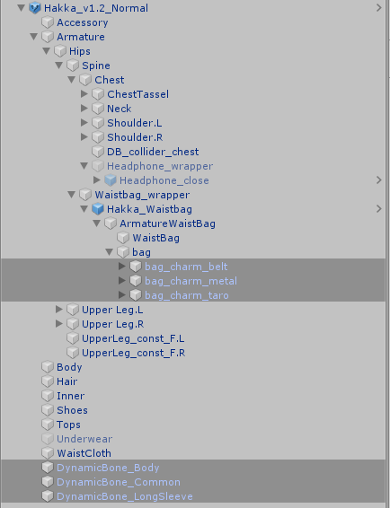
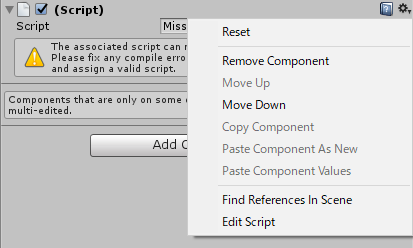

== はじめに

まだドラフトだよ。

まずは
https://scrapbox.io/mio3works/%E3%82%AA%E3%83%AA%E3%82%B8%E3%83%8A%E3%83%AB3D%E3%83%A2%E3%83%87%E3%83%AB_%E8%96%84%E8%8D%B7_%E3%83%89%E3%82%AD%E3%83%A5%E3%83%A1%E3%83%B3%E3%83%88[オリジナル3Dモデル 薄荷 ドキュメント]を読みましょう

== 必要なもの

別途ダウンロードしておく必要なものがいくつかあります。

* Unity 2018.4.20f1
* VRChat SDK 3.0
    ** https://vrchat.com/home/download
* Unity Chan Toon Shader 2 (UTS2)
    ** https://unity-chan.com/download/releaseNote.php?id=UTS2_0
* DynamicBone
    ** Unity Asset Store で購入するか、なしでアップロードできる。

== 導入

以下のような順番でやることで、依存関係に問題をおこさずに導入できます。

. UTS2、SDK3、DynamicBone を Unity にインポート
     ** UTS2 `UTS_ShaderOnly_v*_ Relese.unitypackage`
     ** SDK3 `VRCSDK3-AVATAR-* _ Public.unitypackage`
. 薄荷ちゃん3Dモデルの Unitypackage をインポート

Assets/Hakka_v1/ 以下に Hakka_v1.2_* のようなPrefabが配置されています。
PrefabをSceneのHierarchyに配置することで、アップロード可能な状態になります。

=== DynamicBone をインポートしない場合

Prefab にはあらかじめDynamicBoneのスクリプトがセットアップされているので、
エラーとなりビルドできません（ビルドのボタンは押すことができるが、ログにエラーが出力され、なにも生成されない）。
DynamicBoneをインポートせずにアップロードを進めるには、
DynamicBoneスクリプトを削除する必要があります。
薄荷 v1.2 では、以下のオブジェクトにDynamicBoneスクリプトがセットされています。
これらのオブジェクトからスクリプトを削除することで、エラーを解決できます。

* `Hakka_v1.2_*/DynamicBone_Body`
* `Hakka_v1.2_*/DynamicBone_Common`
* `Hakka_v1.2_*/DynamicBone_LongSleeve`
* `Hakka_v1.2_*/Armature/Hips/Spine/Waistbag_wrapper/Hakka_Waistbag/ArmatureWaistBag/bag/bag_charm_belt`
* `Hakka_v1.2_*/Armature/Hips/Spine/Waistbag_wrapper/Hakka_Waistbag/ArmatureWaistBag/bag/bag_charm_metal`
* `Hakka_v1.2_*/Armature/Hips/Spine/Waistbag_wrapper/Hakka_Waistbag/ArmatureWaistBag/bag/bag_charm_taro`

.DynamicBoneのスクリプトが付いているオブジェクト

これらのオブジェクトをひとつづつ選択し、Inspectorから削除してください。
スクリプトを削除には、`(Script)` となっている右側に表示されている歯車をクリックし、
Remove Componentをクリックすることで削除することができます。

.スクリプトのコンテキストメニューを出したところ

